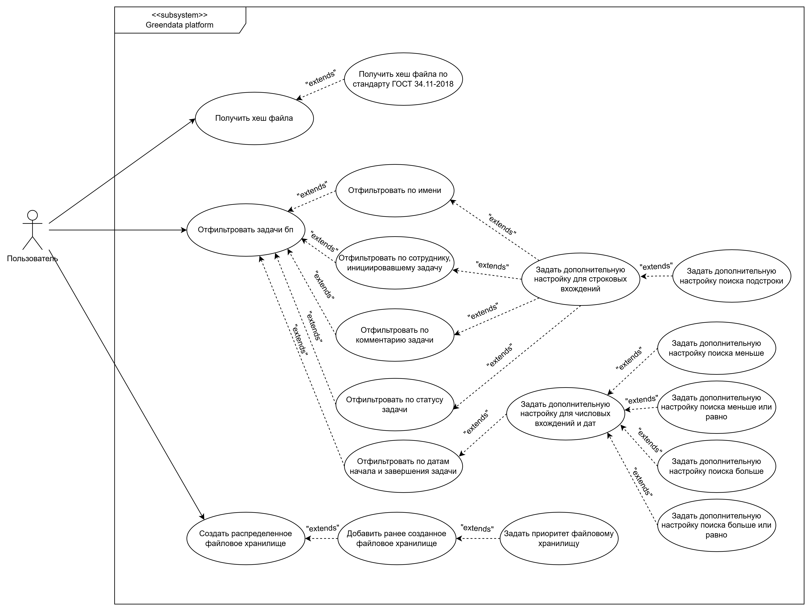

# Тема дипломной работы

Тема дипломной работы звучит так: "Разработка программных модулей для платформы GreenData".  
С моим научным руководителем мы выбрали несколько интересных рабочих задач:

- Добавить функцию хеширования по стандарту ГОСТ 34.11-2018 в алгоритмы
- Добавление EXCEL-фильтров и поиска по объектам в карточке маршрута
- Реализовать отказоустойчивое хранилище на базе платформы GreenData

# Стейкхолдеры

| Стейкхолдер | Краткое описание |
| :---------- | :--------------- |
| Разработчики | Будут расширять/править функционал |
| Аналитики    | Будут использовать разработанный функционал для настройки кейсов заказчиков  |
| Тестировщики | Будут тестировать разработанный функционал |
| Заказчики    | Разработанный функционал будет покрывать бизнес-процессы |

# Требования

## Функция хеширования ГОСТ 34.11-2018

Click to expand

Функциональные требования:

- Возможность хеширования файлов заказчиков
- Хеширование должно осуществляться алгоритмом стандарта ГОСТ 34.11-2018

Нефункциональные требования:

- Согласно 152-ФЗ нужно использовать аккредитованные лабораторией ФСБ средства СКЗИ
- Интеграция аккредитованного лабораторией ФСБ средства СКЗИ в систему

## EXCEL-фильтры в карточке маршрута

Click to expand

Функциональные требования:

- Возможность поиска по именам задач и вложенных бизнес-процессов, именам сотрудников, датам начала и заврешения задач, а также по комментариям и статусам задач в маршруте бизнес-процесса
- Возможность настройки операций больше, больше или равно, меньше, меньше или равно для числовых вхождений и дат в качестве дополнительной настройки фильтрации
- Возможность поиска подстроки для строковых вхождений в качестве дополнительной настройки фильтрации

Нефункциональные требования:

- Операция фильтрации не должна занимает более 50% процентов времени от всего рендера маршрута бизнес-процесса

## Распределенное хранилище данных

Click to expand

Функциональные требования:

- Возможность настройки распределенного хранилища файлов с использованием раннее созданных хранилищ
- Возможность настройки приоритета чтения из хранилищ внутри распределенного храналища

Нефункциональные требования:

- Операции сохранения и удаления файлов должны быть асинхронными и атомарными

# Use-case диаграмма

# Сделанные предположения

- СКЗИ должно идти вместе с образом системы
- Будет ли проходить операция хеширование после истечения лицензии СКЗИ и если да, то как автоматизировать в рамках CI/CD продление лицензии
- Нужно ли откатывать сохранение файла и бросать ошибку в случае, если во все хранилища операция сохранения завершилась с ошибкой
- Нужно ли чистить метадату об операциях с распределенным хранилищем после удаления объекта файла и его контента из хранилищ