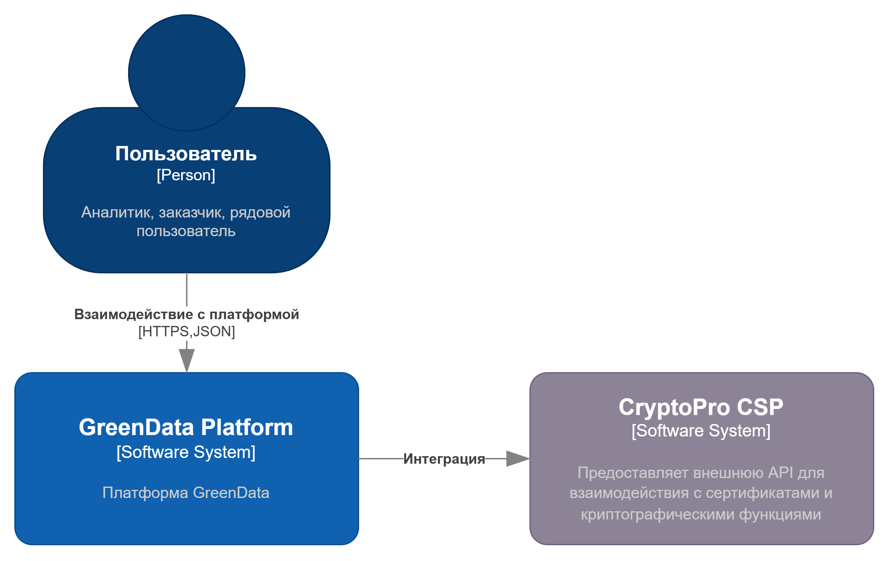
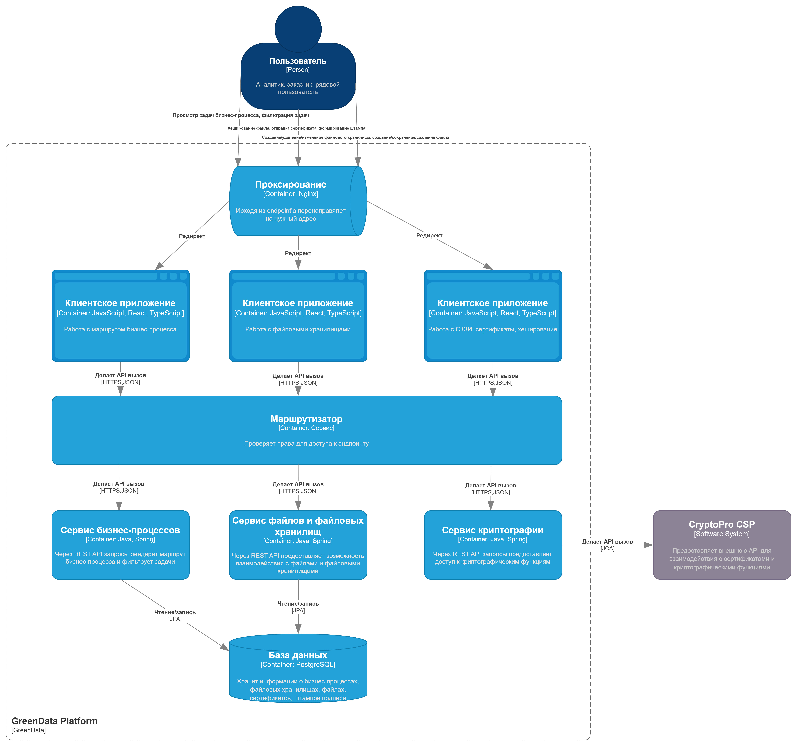
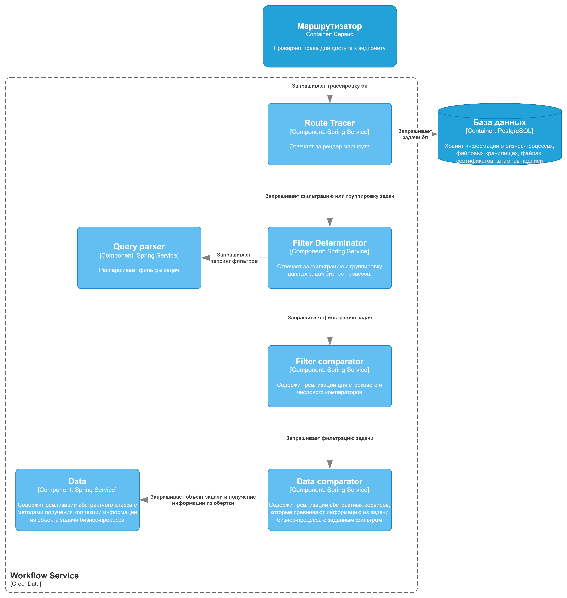
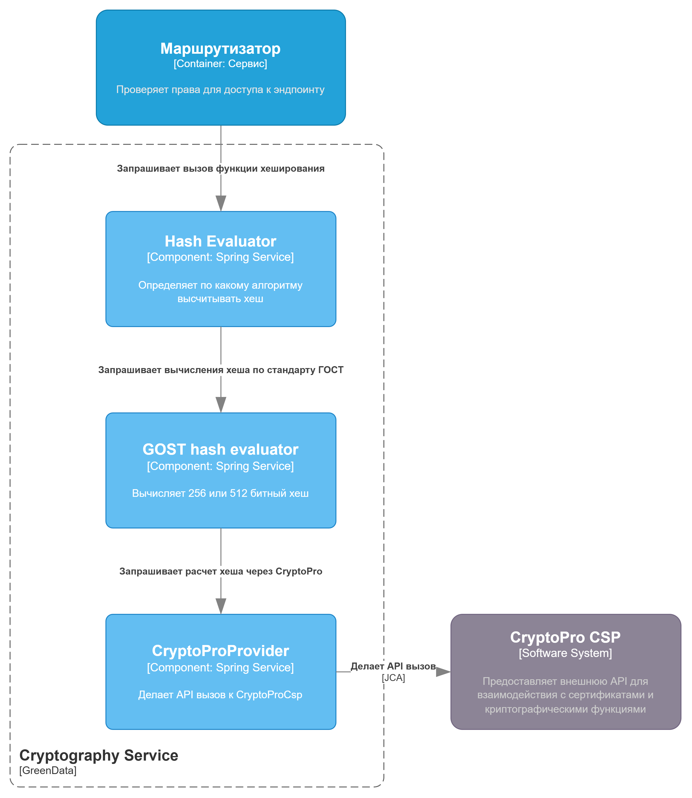

# Диаграмма системного контекста

# Диаграмма контейнеров

Была выбрана микросервисная архитектура как возможность поддержки highload инфраструктуры 

# Диаграмма компонентов сервиса бизнес-процессов

# Диаграмма компонентов сервиса 

