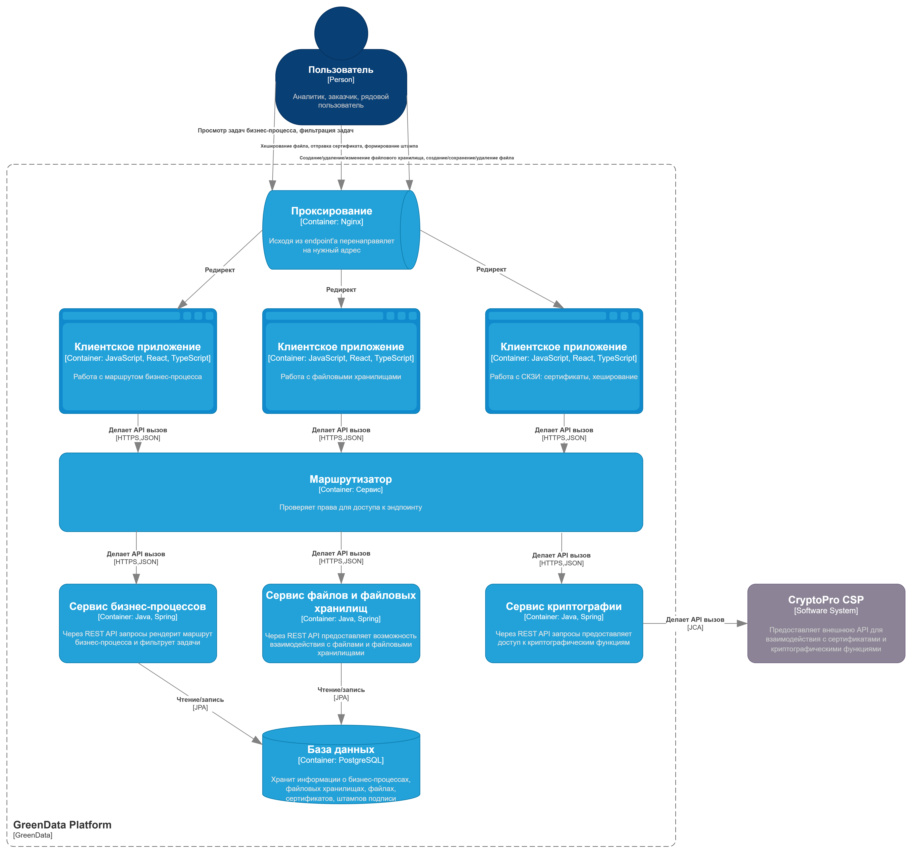
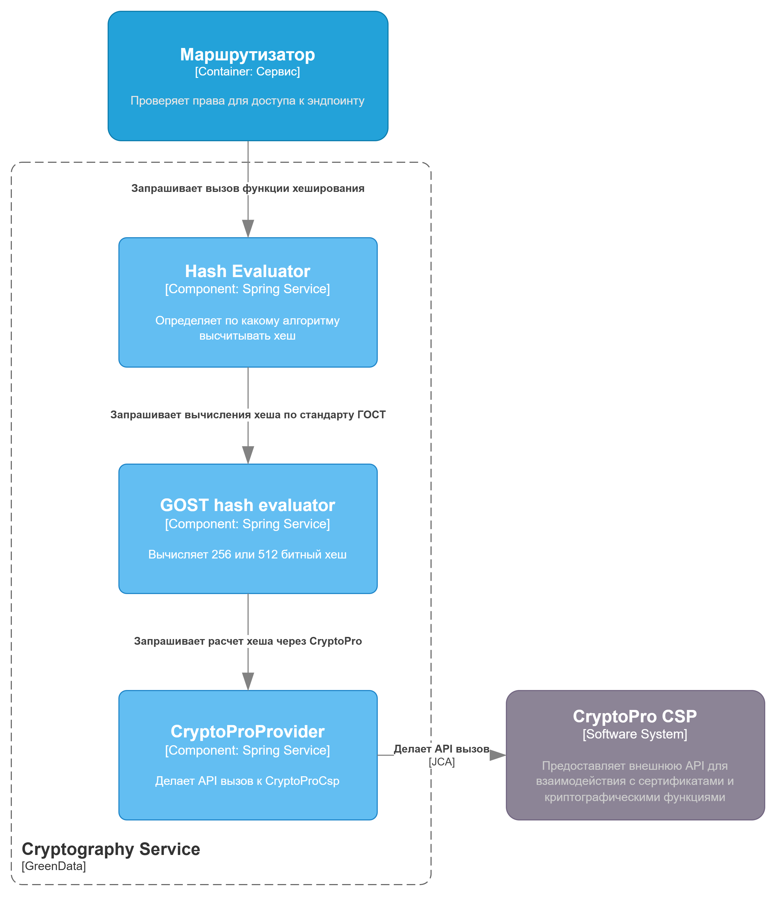
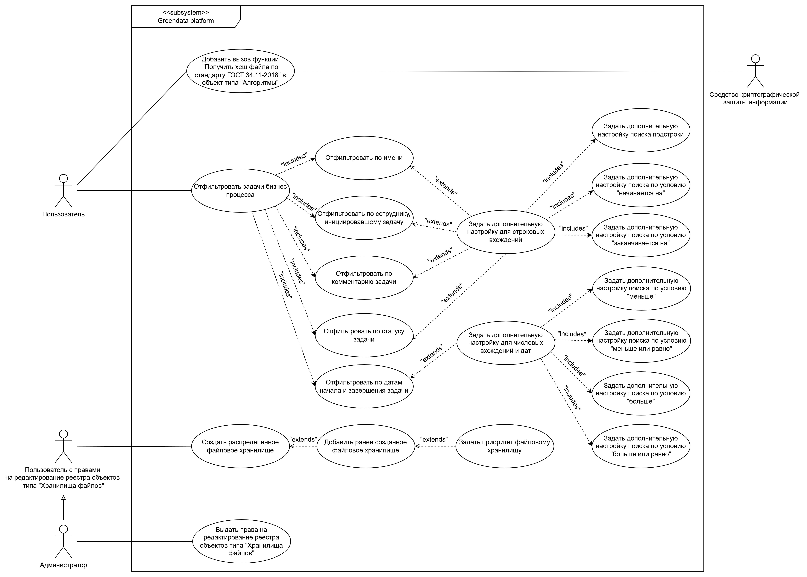
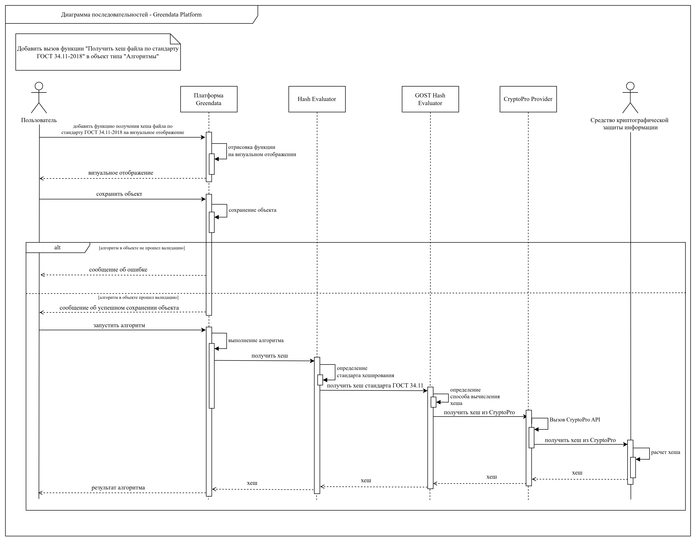
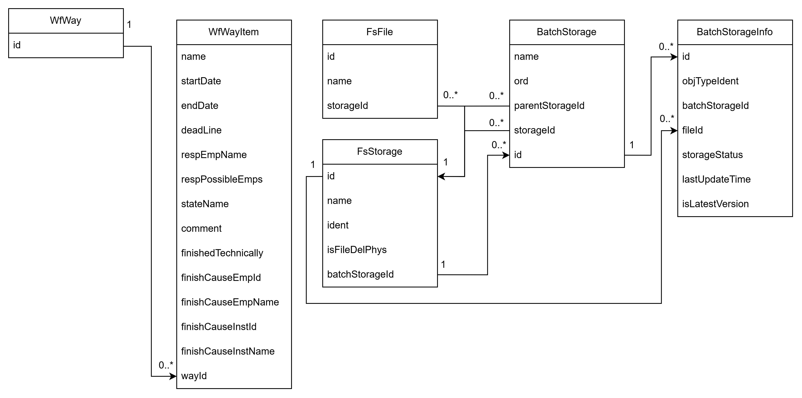

# Диаграмма контейнеров



# Диаграмма компонентов



# UML-диаграммы

## Use-case диаграмма

Для составления диаграммы последовательностей был выбран прецедент "Добавить вызов функции "Получить хеш файла по стандарту ГОСТ 34.11-2018" в объект типа "Алгоритмы"".



## Диаграмма последовательностей для прецедента



# Модель БД



# Применение основных принципов разработки

```typescript
export abstract class WayItemsFilter {
    private readonly wayItemDataRetrieverDispatcher: WayItemDataRetrieverDispatcher;

    constructor(wayItemDataRetrieverDispatcher: WayItemDataRetrieverDispatcher) {
        this.wayItemDataRetrieverDispatcher = wayItemDataRetrieverDispatcher;
    }

    public filterItems = async (items: Set<WfWayItem>,
                                columnIdent: string,
                                args: Array<string>,
                                rsqlOperation: RsqlSearchOperation): Promise<Set<WfWayItem>> => {
        const wayItemDataRetriever: WayItemDataRetriever =
            this.wayItemDataRetrieverDispatcher.getDataRetriever(columnIdent);

        if (wayDataComparator === null) {
            return new Set<WfWayItem>(items);
        }

        const filteredItems: Set<WfWayItem> = new Set();

        items.forEach((item: WfWayItem) => {
            const whetherToAdd: boolean = this.filterItem(wayItemDataRetriever, item, args, rsqlOperation);

            if (whetherToAdd) {
                filteredItems.add(item);
            }
        });

        return filteredItems;
    }

    public abstract supportsRsqlOperation(rsqlOperation: RsqlOperation): boolean;

    protected abstract filterItem(wayItemDataRetriever: WayItemDataRetriever,
                                  item: WfWayItem,
                                  args: Array<string>,
                                  rsqlOperation: RsqlSearchOperation): boolean;
}
```

**YAGNI**: нет неиспользуемых методов и участков кода.  
Метод `supportsRsqlOperation` будет реализован в наследниках данного класса и будет использован в "фабрике".  
Метод `filterItems` и `filterItem` реализуют бизнес-логику, за которую данный класс отвечает.

**KISS**: код прост и легко читаем :)

**DRY**: вынос метода `filterItems` в данный класс позволяет избежать его дублирования в дочерних. 

**SOLID**:  

1. **Single Responsibility Principle**. Данный класс отвечает за одну ответственность: фильтрация задач бизнес-процесса. 
2. **Open-Closed Principle**. В качестве модификации могут выступать новые реализации данного класса или же добавление новых методов, которые не будут изменять существующее поведение.
3. **Liskov Substitution Principle**. Дочерний класс не изменяет принцип работы родительского.

```typescript
export class WayItemsStringFilter extends WayItemsFilter {
    constructor(wayItemDataRetrieverDispatcher: WayItemDataRetrieverDispatcher) {
        super(wayDataComparatorDispatcher);
    }

    public supportsRsqlOperation = (rsqlOperation: RsqlOperation): boolean => {
        //
    }

    protected filterItem = async (wayItemDataRetriever: WayItemDataRetriever,
                                  item: WfWayItem,
                                  args: Array<string>,
                                  rsqlOperation: RsqlSearchOperation): boolean => {
        var whetherToAdd: boolean = false;
        for (arg in args) {
            whetherToAdd = await this.filterItemByData(wayItemDataRetriever, item, arg);
            if (whetherToAdd) {
                break;
            }
        }
        
        return !RsqlSearchOperation.isNotOperator(rsqlOperation) 
            ? whetherToAdd 
            : !whetherToAdd;
    }

    private filterItemByData = async (wayItemDataRetriever: WayItemDataRetriever, item: WfWayItem, arg: string) => {
        //
    }
}
```

4. **Interface Segregation Principle**. Данный интерфейс не является "богом".
5. **Dependency Inversion Principle**. В контексте данных классов нам известно о фабрике `wayItemDataRetrieverDispatcher`, которая порождает извлекателей информации из `WfWayItem`.
Реализация фабрики прокидывается в конструкторе. 

# Дополнительные принципы разработки

**BDUF**. Принцип **Big Design Up Front** ставит проектирование системы во главу угла.  
Данный принцип используется. Перед проектированием была изучена реализуемая предметная область, а потом применены принципы чистой архитектуры и паттернов.

**SoC**. Принцип **Separation of concerns** похож на SRP, но только на уровне компонентов системы.  
Данный принцип реализуется с помощью разбиения на микросервисы и использования чистой архитектуры.

**MVP**. Принцип **Minimum viable product** подразумевает приоритизации разработки функционала системы, имеющего больший приоритет для пользователя.  
Данный принцип не используется, партнерам требуется полная реализация задач.

**PoC**. Принцип **Proof of concept** подразумевает доказательство концепции продукта с помощью урезанной реализации.  
Не используется, так как разработка по требованию партнеров и согласована.