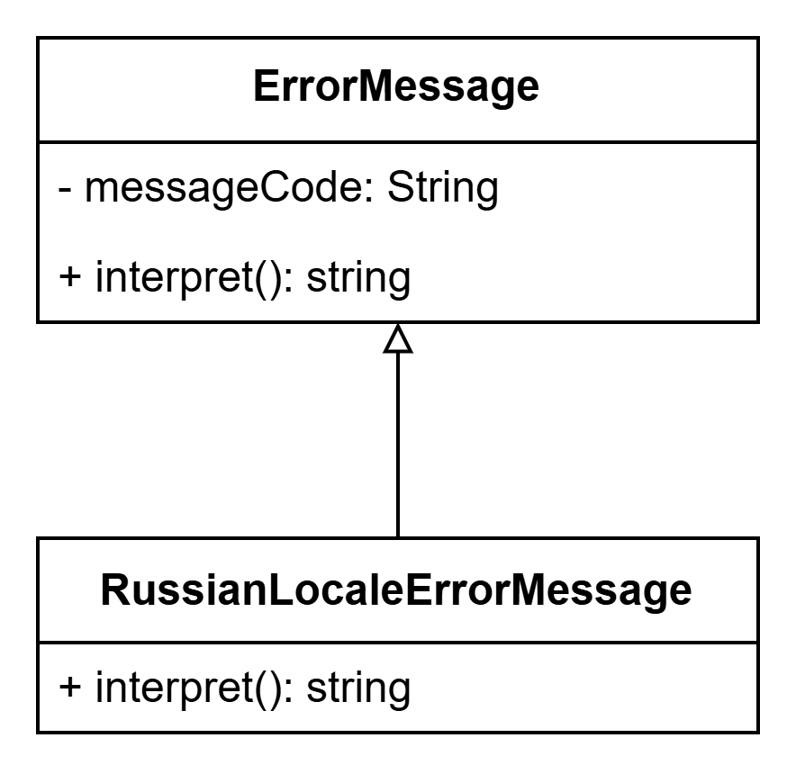

# Шаблоны GoF

## Порождающие шаблоны

### Фабричный метод
>`Фабричный метод` определяет интерфейс создания объекта, но позволяет субклассам выбрать создаваемый экземпляр

На данный момент количество хранилищ - 7.  
Реализация данного паттерна позволит расширять количество хранилищ не изменяя код


```java
public interface FileStorageCreator {
    FileStorage createFileStorage();
}

public class DistributedFileStorageCreator implements FileStorageCreator {
    public FileStorage createFileStorage() {
        return new DistributedFileStorage();
    }
} 

public abstract class FileStorage {
    public abstract Strig getName();
    public abstract Strig getIdent();
}

public class DistributedFileStorage extends FileStorage {
    @Override
    public String getName() {
        ...
    }
    
    @Override
    public String getIdent() {
        ...
    }
}

```


### Абстрактная фабрика
> `Паттерн абстрактная фабрика` предоставляет интерфейс создания семейств взаимосвязанных объектов или взаимозависимых объектов без указания их конкретных классов
 
Реализация данного паттерна позволит расширять количество доступных для использования хеш алгоритмов без изменения существующего кода


```java

public class HashAlgorithmIdent {
    public static String GOST = "GOST";
}

public abstract class HashCalculatorCreator {
    public abstract HashCalculator createHashCalculator(Integer hashLength);
    
    ...
}

@Component
public class GostHashCalculatorCreator extends HashCalculatorCreator {
    private final Map<Integer, HashCalculator> calculators;
    
    @Autowired()
    public GostHashCalculatorCreator(@Qualifier(HashAlgorithmIdent.GOST) 
                                        List<GostHashCalculator> calculators) {
        this.calculators = calculators.stream()
            .toMap(ConcurrentHashMap::new, calculator::supportedHashLength, calculator -> calculator);
    }
    
    @Override
    public HashCalculator createHashCalculator(Integer hashLength) {
        HashCalculator calculator = this.calculators.get(hashLength);
        if (Objects.isNull(calculator) {
            // Ошибка
        }
        
        return calculator;
    }
}

public abstract class HashCalculator {
    public abstract Integer supportedHashLength();
    ...
}

@Component
@Qualifier(HashAlgorithmIdent.GOST)
public abstract class GostHashCalculator extends HashCalculator {
}

@Component
public class 256BitGostHashCalculator extends GostHashCalculator {
    @Override
    public Integer supportedHashLength() {
        return 256;
    }
    
    ...
}

@Component
public class 512BitGostHashCalculator extends GostHashCalculator {
    @Override
    public Integer supportedHashLength() {
        return 512;
    }
    
    ...
}

```


### Синглтон
> `Паттерн одиночка` определяет альтернативный способ создания объектов - в данном случае уникальных
> Одиночка гарантирует, что класс имеет только один экземляр, и предоставляет глобальную точку доступа к этому экземплюру

Для исключения проблем работой с базой данных один обработчик коннектов обязатален.


```java

public class PostgresPool {
	private volatile static PostgresPool uniquePool;

	private PostgresPool() {}

	public static PostgresPool getInstance() {
		if (uniquePool == null) {
			synchronized(PostgresPool.class) {
				if (uniquePool == null) {
					v = new PostgresPool();
				}
			}
		}

		return uniquePool;
	}
}

```

## Структурные шаблоны


## Поведенческие шаблоны

### Стратегия
> `Паттерн Стратегия` определяет семейство алгоритмов, инкапсулирует каждый из них и обуспечивает их взаимозаменяемость. 
> Он позволяет модифицировать алгоритмы независимо от их использования на стороне клиента.


```typescript

export class IntegerTaskDataComparator extends TaskDataComparator {
    private readonly taskDataExtractor: TaskDataExtractor;

    constructor(taskDataExtractor: TaskDataExtractor) {
        super();
        this.taskDataExtractor = taskDataExtractor;
    }

    public filterItems = async (items: Set<WfWayItem>,
                                columnIdent: string,
                                args: Array<string>,
                                rsqlOperation: RsqlSearchOperation): Promise<Set<WfWayItem>> => {
        const wayItemDataRetriever: WayItemDataRetriever =
            this.wayItemDataRetrieverDispatcher.getDataRetriever(columnIdent);

        if (wayDataComparator === null) {
            return new Set<WfWayItem>(items);
        }

        const filteredItems: Set<WfWayItem> = new Set();

        items.forEach((item: WfWayItem) => {
            const whetherToAdd: boolean = this.filterItem(wayItemDataRetriever, item, args, rsqlOperation);

            if (whetherToAdd) {
                filteredItems.add(item);
            }
        });

        return filteredItems;
    }
}

export interface TaskDataExtractor {
    extractTaskData(task: WfWayItem): string;

    supportedAttribute(): string;
}

export class TaskNameExtractor implements TaskDataExtractor {
    extractTaskData(task: WfWayItem): string {
        // ...
        return "";
    }

    supportedAttribute(): string {
        return "NAME";
    }
}

export class TaskCommentaryExtractor implements TaskDataExtractor {
    extractTaskData(task: WfWayItem): string {
        // ...
        return "";
    }

    supportedAttribute(): string {
        return "COMMENTARY";
    }
}

```

### Итератор
> Представляет доступ ко всем элементам составного объекта, не раскрывая его внутреннего представления.

Можно проитерировать хранилища внутри составного

### Интерпретатор
> Паттерн Интерпретатор (Interpreter) определяет представление грамматики для заданного языка и интерпретатор предложений этого языка.



```java

public abstract class ErrorMessage {
    private final String messageCode;
    
    protected ErrorMessage(String messageCode) {
        this.messageCode = messageCode;
    }
    
    public abstract String interpret();
}

public class RussianLocaleErrorMessage {
    public RussianLocaleErrorMessage(String messageCode) {
        super(messageCode);
    }
    
    @Override
    public string interpret() {
        return switch(this.messageCode) {
            case "object-not-found" -> "Объект не был найден";
            case "no-read-rights-on-object" -> "Нет прав на чтение объекта";
            default -> "Неизвестный код ошибки";
        }
    }
}

```